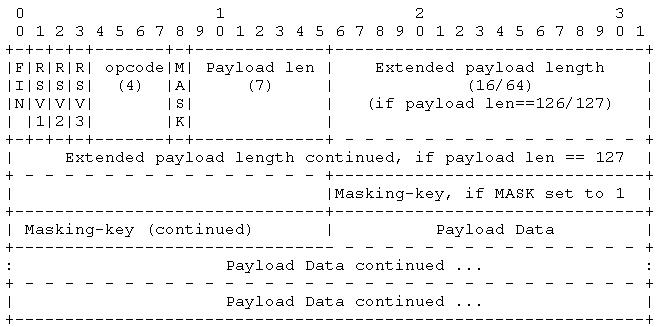

# WebSocket (RFC6455)

## 1. 背景

在以往许多有双向通讯需求的web应用中，都可能存在以下提及的各种问题。
* 客户端滥用 HTTP 请求轮询服务器来请求更新，此外，HTTP协议还具有较高的通讯开销，因为每个请求和响应都附有HTTP首部。
* 客户端监控每一个HTTP请求的结果，以判断是继续发送请求还是渲染结果。
* 前后端被迫重新实现一套基于TCP的消息收发服务，带来较大的开发及维护成本；若客户端为浏览器，还无法采用采用该方案。

## 2. websocket 协议概述

### 2.1 设计理念
综上所述，web应用需要一个规范、标准统一、支持服务端\客户端双向通讯的通讯协议。
作为HTTP的补充协议，WebSocket正是为web应用实现双向通信而设计的协议，并从现有的HTTP基础设施受益，如：
* 支持HTTP代理
* 过滤（域名限制）
* 认证（基于HTTP首部或URL参数的自定义认证机制）
* 工作于80、443端口上
* 使用HTTP协议进行握手，而非重新定义整套通讯协议

WebSocket的设计理念是基于TCP协议，完成以下的工作：
* 为浏览器添加`origin-based`的安全模型。
* 通过定位（e.g. Host: xxxxx）和协议命名机制(e.g. Upgrade: websocket),支持在同一个端口上提供多个服务和同一个IP上有多个主机名。
* 基于TCP协议实现帧机制，且不设帧长度限制。

### 2.2 连接握手
打开握手兼容基于HTTP的服务器端程序和中间设施(如，nginx)，使同一个端口能够接受HTTP客户端和WebSocket客户端，为了这个目的，WebSocket客户端的握手是基于HTTP GET请求的升级。
<pre><code>
GET /chat HTTP/1.1
Host: server.example.com
Upgrade: websocket
Connection: Upgrade
Sec-WebSocket-Key: dGhlIHNhbXBsZSBub25jZQ==
Origin: http://example.com
Sec-WebSocket-Protocol: chat, superchat
Sec-WebSocket-Version: 13
</code></pre>

为了证明握手被接收，服务器把两块信息合并来形成响应。第一块信息来自客户端握手首部`Sec-WebSocket-Key`，如：
`Sec-WebSocket-Key: dGhlIHNhbXBsZSBub25jZQ==`
对于这个头域，服务器取字段的值，trim操作后，以字符串的形式拼接自身的GUID：`258EAFA5-E914-47DA-95CA-C5AB0DC85B11`，此值不大可能被不明白WebSocket协议的网络终端使用。然后进行`SHA-1` hash（`160`位）编码，再进行`base64`编码，将结果作为服务器的握手返回。

具体如下：   
请求头：`Sec-WebSocket-Key: dGhlIHNhbXBsZSBub25jZQ==`   
取值，字符串拼接后得到：`"dGhlIHNhbXBsZSBub25jZQ==258EAFA5-E914-47DA-95CA-C5AB0DC85B11"`;   
`SHA-1`后得到：` 0xb3 0x7a 0x4f 0x2c 0xc0 0x62 0x4f 0x16 0x90 0xf6 0x46 0x06 0xcf 0x38 0x59 0x45 0xb2 0xbe 0xc4 0xea`   
`Base64`后得到：` s3pPLMBiTxaQ9kYGzzhZRbK+xOo=`   
最后的结果值作为响应头 `Sec-WebSocket-Accept` 的值。

来自服务器的握手比客户端的简单很多。首先是HTTP 状态行，状态码是`101`：
`HTTP/1.1 101 Switching Protocols`
任何非`101`的状态码表示WebSocket握手还没有完成，HTTP语义仍然生效。

`Connection`和`Upgrade`头域完成HTTP升级。`Sec-WebSocket-Accept` 头表明服务器是否愿意接受连接。如果有，值必须是前面提到的算法得到的值，否则不能解释为服务器接受连接。
<pre><code>
HTTP/1.1 101 Switching Protocols
Upgrade: websocket
Connection: Upgrade
Sec-WebSocket-Accept: s3pPLMBiTxaQ9kYGzzhZRbK+xOo=
</code></pre>
这些字段由WebSocket客户端为脚本页面检测，如果`Sec-WebSocket-Accept`的值不符合预期的值，如果头缺失， 或HTTP状态码不是`101`，连接不会建立，WebSocket帧不会发送。

### 2.3 断开连接握手
相比连接握手，断开连接握手可是说是相当的简单了。

服务端或客户端任意一方发送一个带有特定数据序列的控制帧（关闭帧）请求断开连接
另一方在收到后回复关闭帧即完成整个断开连接握手。

帧的概念本文后续将会详细讨论。

### 2.4 WebSocket URIs
本规范定义了两种`URI`方案，使用在`RFC5234`定义的ABNF语法、术语和在`RFC3986`定义的URI规范的`ABNF`成果。
<pre><code>
ws-URI = "ws:" "//" host [ ":" port ] path [ "?" query ]
wss-URI = "wss:" "//" host [ ":" port ] path [ "?" query ]
</code></pre>
`host`服务域名
`port`部分是可选的；`ws`默认的端口是`80`，`wss`默认是`443`。
`path`WebSocket路径
`query`参数

## 3. 基于WebSocket进行通讯

### 3.1 帧的定义
用于数据传输部分的有线格式用ABNF描述，细节在本节。（注意，不像本文档中的其他章节，本节的ABNF是作用于一组比特位上。每组比特位的长度在注释里指示。当在有线上编码后，最重要的比特的最左边的ABNF）。帧的一个高层概览见下图。当下图与ABNF有冲突时，图是权威的。   

FIN： 1bit   
　　表示此帧是否是消息的最后帧。第一帧也可能是最后帧。

RSV1，RSV2，RSV3： 各1bit 
　　必须是0，除非协商了扩展定义了非0的意义。如果接收到非0，且没有协商扩展定义此值的意义，接收端必须使WebSocket连接失败。

Opcode： 4bit 
　　定义了"Payload data"的解释。如果接收到未知的操作码，接收端必须使WebSocket连接失败。下面的值是定义了的。
　　%x0 表示一个后续帧
　　%x1 表示一个文本帧
　　%x2 表示一个二进制帧
　　%x3-7 为以后的非控制帧保留
　　%x8 表示一个连接关闭
　　%x9 表示一个ping
　　%xA 表示一个pong
　　%xB-F 为以后的控制帧保留

Mask： 1bit
　　定义了"Payload data"是否标记了。如果设为1，必须有标记键出现在masking-key，用来unmask "payload data"，见5.3节。所有从客户端发往服务器的帧必须把此位设为1。

Payload length： 7bit, 7 + 16bit, 7 + 64bit
　　"Payload data"的长度，字节单位。

Masking-key：`0`或`4`字节
　　所有从客户端发往服务器的帧必须用`32`位值标记，此值在帧里。如果mask位设为1，此字段（`32`位值）出现，否则缺失。更多的信息在`5.3`节，客户端到服务器标记。

Payload data： (x + y)字节

### 3.2 数据帧
数据帧（如非控制帧）由操作码标识，操作码的最高位是`0`。当前为数据帧定义的操作码有`0x1`（文本），`0x2`（二进制）。操作码`0x3-0x7`为以后的非控制帧保留，未定义。

数据帧携带 应用程序层 和/或 扩展层 数据。操作码决定了数据的解释：   
文本：   
　　有效载荷数据是`UTF-8`编码的文本数据。注意，特定的文本帧可能包含部分的`UTF-8`	序列，然而，整个消息必须包含有效的`UTF-8`。
   
二进制：   
　　有效载荷数据是任意的二进制数据，它的解释由应用程序层唯一决定。

### 3.3 控制帧

#### 3.3.1 关闭
关闭帧操作码为`0x8`。

关闭帧可能包含一个主体（帧的应用数据部分）指明关闭的原因，如终端接收到的帧太大，或终端接收到的帧不符合终端的预期格式。如果有主体，主体的前`2`个字节必须是`2`字节的无符号整数（按网络字节序），表示以`/code/`的值为状态码。在`2`字节整数后，主体包含一个`UTF-8`编码的字符串表示原因。这些数据不一定要人类可读，但应能做到对调试友好。

从客户端发送到服务器的关闭帧必须标记

在发送关闭帧后，应用程序必须不再发送任何数据。

如果终端接收到一个关闭帧，且先前没有发送关闭帧，终端必须发送一个关闭帧作为响应。（当发送一个关闭帧作为响应时，终端典型地以接收到的状态码作为回应。）它应该尽快实施。终端可能延迟发送关闭帧，直到它的当前消息发送完成（例如，如果分帧消息的大部分已发送，终端可能在关闭帧之前发送剩余的帧）。

在发送和接收到关闭消息后，终端认为WebSocket连接已关闭，必须关闭底层的TCP连接。

#### 3.3.2 Ping
Ping帧操作码为`0x9`。

一个Ping帧可能包含应用程序数据。
当接收到Ping帧，终端必须发送一个Pong帧响应，除非它已经接收到一个关闭帧。

**注意**：Ping帧可作类似TCP心跳包验证远程终端是否可响应的机制使用。

#### 3.3.3 Pong
Pong帧操作码为`0xA`。

Pong帧必须包含与被响应Ping帧的应用程序数据完全相同的数据。
如果终端接收到一个Ping帧，终端可应发送一个Pong帧给最近处理的Ping帧。
一个Pong帧也可能作为单向心跳被主动发送。接受到Pong帧的一方，不建议回复。

### 3.4 数据收发
#### 3.4.1 发送数据
为在WebSocket连接上发送一个由`/data/`组成的WebSocket消息，终端必须执行下面的步骤：

1. 终端必须确保WebSocket连接处于连接状态。在任何时刻，如果WebSocket连接的状态改变，终端必须终止下面的步骤。

2. 终端在WebSocket帧里封装数据。如果数据太大可选择封装数据为一个序列的帧

3. 包含数据的第一帧的操作码（`frame-opcode`）必须设置为恰当的值，因为这将决定数据将接收方解释为文本或二进制数据。

4. 包含数据的最后帧的`FIN`位（`frame-fin`）必须设置为`1`。

5. 如果数据由客户端发送，帧必须被标记。

6. 已形成的帧必须在底层的网络连接上传输。

#### 3.4.2 接收数据
为了接收WebSocket数据，终端监听底层的网络连接。到来的数据必须按上述定义(3.2)的WebSocket帧解析。如果接收到控制帧，必须按上述定义(3.3)处理。当接收到数据帧时，终端必须知道数据的类型，通过操作码（`frame-opcode`）定义。帧的`Application data`是定义为消息的`/data/`的。如果帧包含一个未分帧的消息，就是说接收到一个包含类型和数据的WebSocket消息。如果帧是分帧了的消息的一部分，应用数据是后续帧的数据的拼接。当最后帧（有`FIN`位指示）接收到时，就是说WebSocket消息接收到了，数据由所有帧的应用数据拼接组成，类型由第一帧指示。后续的数据帧必须解释为属于新的WebSocket消息的。

### Reference
* The WebSocket Protocol, Fette & Melnikov https://tools.ietf.org/html/rfc6455#section-1.2 